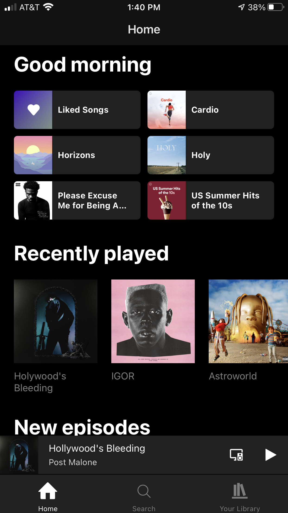
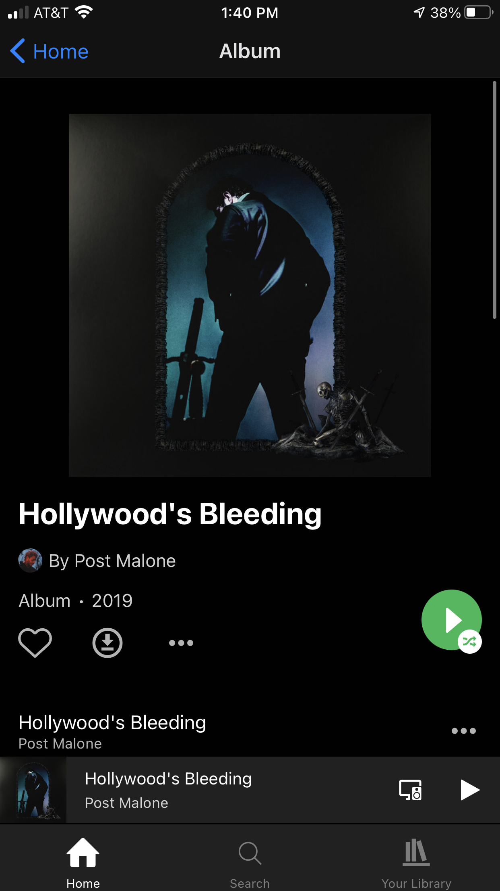

# Spotify Clone

## Dean Stratakos

### January 21, 2020

*Spotify Clone* is a React Native app that implements frontend features of the Spotify app.

After starting out with (this tutorial)[https://www.youtube.com/watch?v=Ho41KNKvoBc&t=22s], I built out more components and improved upon the styling.
