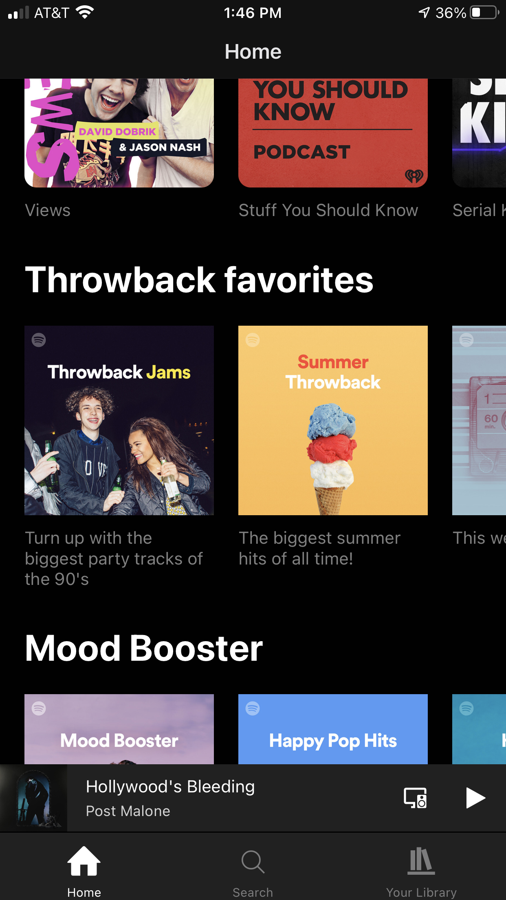

# Spotify Clone

## Dean Stratakos

### January 21, 2020

*Spotify Clone* is a React Native app that implements frontend features of the Spotify app.

#### Home Screen

    

        

            

                <h4>Home Screen</h4>
                

                    
                    
                

            

            

                <h4>Album Screen</h4>
                

                    
                    
                

            

        

    

After starting out with (this tutorial)[https://www.youtube.com/watch?v=Ho41KNKvoBc&t=22s], I built out more components and improved upon the styling.
